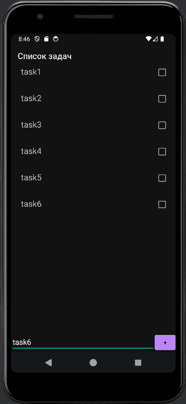
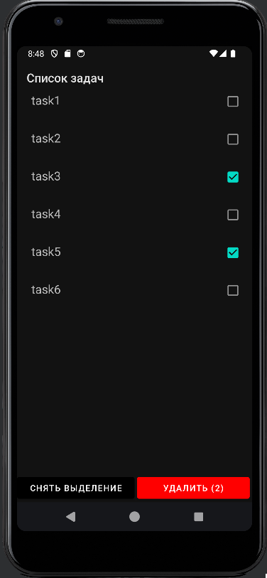
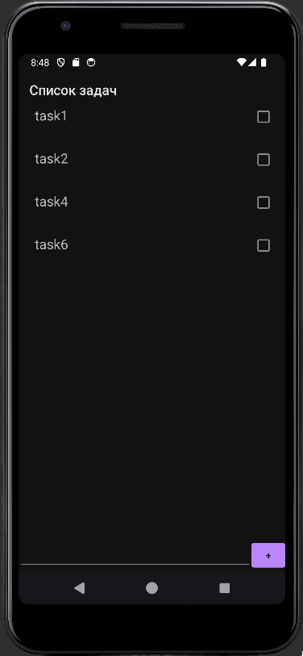

# android-todo-app

Приложение для составления списка задач

Используется архитектура MVVM.

Список задач отображается при помощи RecyclerView.
Для оптимизации списка используется DiffUtil.

Меню в нижней части экрана реализовано с помощью фрагментов.
Фрагменты и Activity используют общую TasksViewModel.

Для DI используется Dagger2.
Данные хранятся в БД (Room).

Планирую добавить TasksRemoteDataSource для работы с сервером через Retrofit

## Скриншоты
### 1. Добавление задач

### 2. Выделение задач

### 3. Удаление задач
